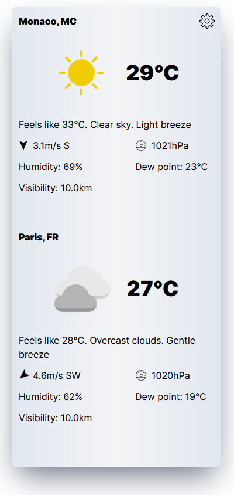
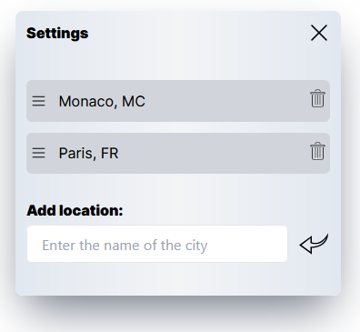

# weather-widget
The Weather Widget is a `Vue.js` component that displays weather information for a specific city. It provides real-time data such as __*temperature*__, __*humidity*__, __*wind speed*__, and __*atmospheric pressure*__. The widget includes an interactive interface that allows users to easily view and understand the current weather conditions.
## Project description
The widget's functionality allows users to add new cities and remove old ones. It also provides the ability to change the order of displaying cities by dragging and dropping them using an icon in the settings.

<div align="center">
  
  <p> </p>
  
</div>


## Project setup
```
npm git clone git@github.com:romkevi4/weather-widget.git
```

```
npm install
```

### Compiles and hot-reloads for development
```
npm run serve
```

### Compiles and minifies for production
```
npm run build
```

## Project link

[weather-widget](https://weather-widget-9ya2bcw8z-romkevi4.vercel.app/)